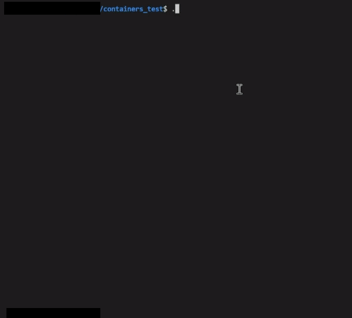

# ft_containers_test
Simplified ft_containers 42 Schools project tester written in C++

<p align="center">
	
</p>

## Disclaimer

This is a simple tester to check for possible errors within the 42 Schools ft_container project.
Passing this tester does not guarantee the project was done correctly.

## How To Use


From the directory where your ft_containers (vector.hpp, map.hpp, stack.hpp) are located:

```bash
git clone https://github.com/AdinkraCoders/ft_containers_test.git && cd ./ft_containers_test/
```

Expected tree after running the above command:

```
. [ft_container]
├── [...]
├── map.hpp
├── stack.hpp
├── vector.hpp
├── [...]
└── containers_test
	├── [...]
	├── do.sh
    └── [...]
```

If your project does not fit the expected tree (e.g. has sub-directories and/or your ft_container file names are UpperCamel-cased) \
Please edit the third line of each `./srcs/<container>/common.hpp` (for filenames) \
Or modify the variable `include_path` in `fct.sh` (to set special path)

Then what? \
There are three executable commands! How do we use them?

```bash
./do.sh [container_to_test] [...]
./cmp_one <path/to/test_file>
./one <path/to/test_file> [namespace=ft]
```

Examples:
```bash
./do.sh # tests map, stack, vector
./do.sh vector stack # tests only vector && stack

./cmp_one srcs/map/bounds.cpp # prints the result comparison (ft/std) on this test file only

./one srcs/map/bounds.cpp # prints the output of this test file using ft namespace
./one srcs/map/bounds.cpp std # prints the output of this test file using the std namespace
```

How to read the output ?
```
The [ ✅ / ❌ ] emojis shows if they behave the same, i.e if the STL and your implementation:
- compile the same way,
- return the same number,
- print the same output.

If a diff occurs, a deepthought is created and logs are kept.

The [Y/N] shows if the STL compile (Y) or not (N), there are some test where you should not compile.
```

## Tested features
- [x] vector
- [x] map
- [x] stack

## Credits

This is a compatibility update to the remarkable work previously done by mli42 Github user. \
Thank you!
